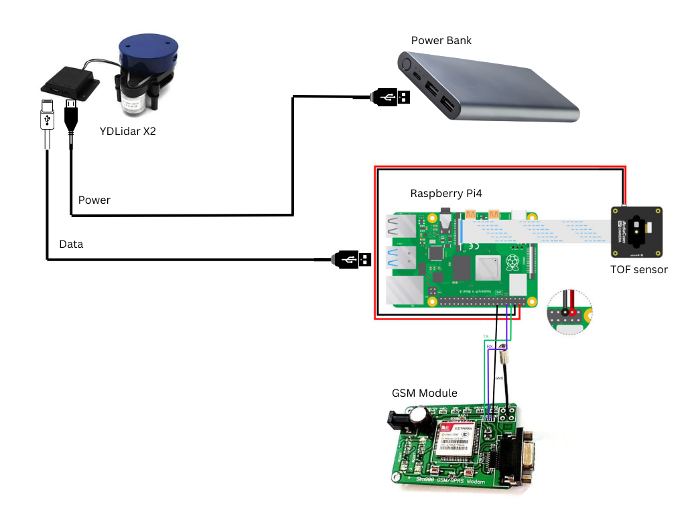

# Wearable Navigation Aid for Visually Impaired Individuals Using LiDAR and Raspberry Pi Zero

## Table of Contents
1. [Introduction](#introduction)
2. [Overview](#overview)
3. [Components Required with Bill of Materials](#components-required-with-bill-of-materials)
4. [Table for Pin Connections](#table-for-pin-connections)
5. [Pinout Diagram](#pinout-diagram)
6. [Working Code](#working-code)
7. [Demo Video](#demo-video)
8. [Acknowledgements](#acknowledgements)
9. [Result](#result)
10. [Conclusion](#conclusion)
11. [Future Improvement](#future-improvement)
12. [Presentation](#presentation)
13. [Setup and Installation](#setup-and-installation)
14. [Usage Instructions](#usage-instructions)
15. [Contribution Guidelines](#contribution-guidelines)
16. [License](#license)

## Introduction

Visually impaired individuals face significant challenges in navigating their surroundings, often leading to accidents and reduced independence. Traditional mobility aids like canes provide limited information about the environment, primarily detecting obstacles at ground level. There is a need for a more advanced solution that can detect obstacles at various heights and provide real-time feedback to enhance mobility and safety. Central to this transformation is the "Wearable Navigation Aid for Visually Impaired Individuals Using LiDAR and Raspberry Pi Zero," which embodies the blend of convenience, safety, and innovation. Leveraging the capabilities of LiDAR sensors, a Raspberry Pi Zero, MPU sensors, GPS, GSM modules, servo motors, and ESP32, this project offers practical solutions to everyday challenges, enhancing the way visually impaired individuals interact with their environment.

Traditional methods of navigation for the visually impaired can be cumbersome, tiresome, and inefficient. This technology eliminates such challenges by allowing users to navigate their surroundings with real-time obstacle detection and haptic feedback, reducing the need for physical interaction. The wearable navigation aid can be utilized in a wide range of applications, from enhancing mobility and safety to providing location tracking and emergency communication features, significantly improving the quality of life for visually impaired individuals and simplifying everyday tasks across diverse environments.

## Overview

The project showcased here introduces an innovative solution utilizing wearable technology to enhance the mobility and safety of visually impaired individuals. Central to this system are LiDAR sensors, a Raspberry Pi Zero, MPU sensors, GPS, GSM modules, servo motors, and ESP32, which together provide real-time obstacle detection and spatial awareness through haptic feedback. This technology-driven approach offers a comprehensive and user-friendly solution to the challenges faced by visually impaired individuals in navigating their environment.
<ul>
    <li><b>LiDAR Sensors:</b> Detect obstacles and provide spatial awareness, scanning the environment and detecting obstacles at various heights.</li>
    <li><b>Raspberry Pi Zero:</b> Acts as the main processing unit, handling data from all sensors and modules.</li>
    <li><b>MPU Sensors:</b> Detect orientation and movement, adjusting LiDAR scanning based on hand movements.</li>
    <li><b>GPS Module:</b> Offers location tracking and route guidance, enhancing navigation capabilities.</li>
    <li><b>GSM Module:</b> Allows for sending alerts and receiving commands, providing emergency communication features.</li>
    <li><b>Servo Motors:</b> Rotate LiDAR sensors for a wider field of view, ensuring comprehensive obstacle detection.</li>
    <li><b>ESP32:</b> Functions as a microcontroller for the secondary bracelet, coordinating with the main unit.</li>
    <li><b>Battery:</b> Powers all components, optimized for longer battery life through efficient power management strategies.</li>
</ul>
Users can benefit from increased confidence and independence in navigating their surroundings. The combination of real-time obstacle detection, haptic feedback, and navigation features exemplifies the practical application of advanced technology in enhancing the quality of life for visually impaired individuals. This project highlights the integration of IoT and wearable technology to provide a reliable and effective mobility aid.

## Components Required with Bill of Materials
<table>
  <tr>
    <th>Item</th>
    <th>Quantity</th>
    <th>Description</th>
    <th>Links to Products</th>
  </tr>
  <tr>
    <td>Raspberry Pi 4</td>
    <td>1</td>
    <td>Single-board computer</td>
    <td><a href="https://www.raspberrypi.org/products/raspberry-pi-4-model-b/">Raspberry Pi 4</a></td>
  </tr>
  <tr>
    <td>YDLidar X2</td>
    <td>1</td>
    <td>360-degree 2D LiDAR</td>
    <td><a href="https://www.ydlidar.com/products/view?id=10">YDLidar X2</a></td>
  </tr>
  <tr>
    <td>ArduCam ToF Camera</td>
    <td>1</td>
    <td>Time-of-Flight camera</td>
    <td><a href="https://www.arducam.com/product/arducam-tf-mini-tof-camera/">ArduCam ToF Camera</a></td>
  </tr>
  <tr>
    <td>GSM SIM 800</td>
    <td>1</td>
    <td>GSM/GPRS module for communication</td>
    <td><a href="https://amzn.in/d/6DhYH6h">GSM SIM 800</a></td>
  </tr>
  <tr>
    <td>MPU Sensor</td>
    <td>1</td>
    <td>Accelerometer and gyroscope sensor</td>
    <td><a href="https://amzn.in/d/7DhJG8g">MPU Sensor</a></td>
  </tr>
  <tr>
    <td>9V Battery</td>
    <td>1</td>
    <td>Battery for power supply</td>
    <td><a href="https://amzn.in/d/4DhYH5b">9V Battery</a></td>
  </tr>
  <tr>
    <td>Microphone</td>
    <td>1</td>
    <td>Microphone for audio input</td>
    <td><a href="https://amzn.in/d/5DhYG7c">Microphone</a></td>
  </tr>
  <tr>
    <td>Speaker</td>
    <td>1</td>
    <td>Speaker for audio output</td>
    <td><a href="https://amzn.in/d/3DhXG2d">Speaker</a></td>
  </tr>
</table>

## Table for Pin Connections

<table>
  <tr>
    <th>Component</th>
    <th>Pin on Raspberry Pi</th>
    <th>Pin Description</th>
  </tr>
  <tr>
    <td>YDLidar X2</td>
    <td>USB Port</td>
    <td>Power and Data</td>
  </tr>
  <tr>
    <td>TOF Sensor</td>
    <td>CSI Port</td>
    <td>Data Line (CSI)</td>
  </tr>
  <tr>
    <td></td>
    <td>GPIO 3 (SCL)</td>
    <td>Clock Line (SCL)</td>
  </tr>
  <tr>
    <td></td>
    <td>GPIO 2 (SDA)</td>
    <td>Data Line (SDA)</td>
  </tr>
  <tr>
    <td>GSM Module</td>
    <td>GPIO 14 (TXD)</td>
    <td>Data Transmission (TX)</td>
  </tr>
  <tr>
    <td></td>
    <td>GPIO 15 (RXD)</td>
    <td>Data Reception (RX)</td>
  </tr>
  <tr>
    <td></td>
    <td>GPIO 4</td>
    <td>Power</td>
  </tr>
  <tr>
    <td></td>
    <td>GND</td>
    <td>Ground</td>
  </tr>
</table>

## Pinout Diagram

##Demo Video

  

  

    

